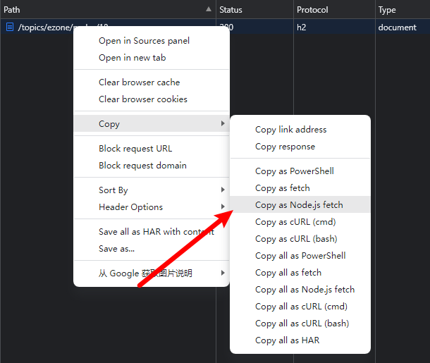

# ESpider
爬取ETF拯救世界合集金句

## 使用
在命令行中执行index.js文件，需配置参数，第一个参数为模块名称，第二个参数为划线类型。

```markdown
可选的模块名称：
- idea
- strategy
- philosophy

可选的划线类型
- official
- hotLine
- personal
```
```javascript
node index idea official 
```
由于有知有行网站需要登录后才能浏览文章，在使用此代码时，需要获取有效的cookie。

具体方法为，在浏览器（建议chrome）中打开有知有行官网[此链接](https://youzhiyouxing.cn/topics/ezone/nodes/2) 后，
点击鼠标右键选择检查，出现开发人员工具界面，点击network一栏，刷新页面，找到 path 为 `topics/ezone/nodes/2`的请求，点击右键后如图操作。



替换掉当前目录下 config 文件中requestHeader 等号后的值。


## 提示
代码中使用到了`puppeteer`这个依赖，但是由于安装`puppeteer`过程中，需要下载 `chromium`，失败概率较高。

本代码使用本地下载好的的chromium， 也即如下代码中对应的逻辑，如果代码执行报相关错误，需要保证该路径下有可执行的 chrome 程序。

```javascript
const browser = await puppeteer.launch({
    executablePath: './chrome-win/chrome.exe',
  });

当然，除此之外，还有别的办法可以解决，此处不再赘述，可自行上网搜寻。
```
